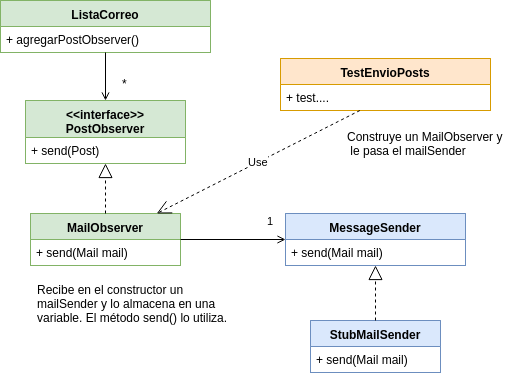

# Ejercicio de Diseño - Lista de Correo

[](https://travis-ci.org/uqbar-project/eg-lista-correo-xtend) [](https://coveralls.io/github/uqbar-project/eg-lista-correo-xtend?branch=master&service=github) 


## Dominio
Queremos modelar una lista de correo

* cuya suscripción pueda ser moderada por un administrador o bien ser libre
* cuyo envío de mails pueda ser abierto o cerrado

Dejamos aquí el link al [enunciado completo](https://docs.google.com/document/d/1o0Bc2Az38ii7YzbsDVX-v8bu3-eBbIdsJqKABMArqv0/edit?usp=sharing)

## Conceptos a ver

Muestra cómo implementar los patrones 

* **Strategy**: para envío de mails a una lista abierta/restringida, 
* **Observer**: diferentes comportamientos ante el envío de posts
* y cómo testear con **stubs/mocks** para simular el envío de mails. 

Utiliza el framework [Mockito](http://site.mockito.org/) para trabajar con mocks. Dejamos el link a la [explicación del ejercicio](https://docs.google.com/document/d/1aw8p79d78zos47ommvwZw6fIkHH_Qx_SBfwU3yfJ96k/edit)

## Branches de soluciones alternativas

* branch [__simple__](https://github.com/uqbar-project/eg-lista-correo-xtend/tree/simple): es una versión simplificada del ejercicio, que no utiliza observers ya que solo le interesa enviar mail como única acción al recibir un mensaje.
* branch [__master__](https://github.com/uqbar-project/eg-lista-correo-xtend/): tenés la solución que trabaja la **inyección de dependencias** del MessageSender **en el constructor** del MailObserver
* branch [__singleton__](https://github.com/uqbar-project/eg-lista-correo-xtend/tree/singleton): el componente que envía mails es un Stub Singleton y dificulta seriamente los tests (falla el test de mockito porque no se puede cambiar dinámicamente la implementación del messageSender)
* branch [__service-locator__](https://github.com/uqbar-project/eg-lista-correo-xtend/tree/service-locator): implementa el patrón arquitectural [Service Locator](https://en.wikipedia.org/wiki/Service_locator_pattern) como una forma de desacoplar el MessageSender a utilizar para el test unitario vs. el que usaríamos en la aplicación.

## Branches de otras soluciones
* branch [__strategy-bloques__](https://github.com/uqbar-project/eg-lista-correo-xtend/tree/strategy-bloques): utiliza strategies con bloques de código que implementan una interfaz Validador + un builder para construir la lista
* branch [__decorator__](https://github.com/uqbar-project/eg-lista-correo-xtend/tree/decorator): decora la lista común para generar listas de envío restringido. **Atención: ** La solución es compleja y difícil de seguir, no es recomendable para estudiar por primera vez el Decorator.

## Objetivo de _master_

En este branch, el test que valida el envío de mails asigna un messageSender por defecto:

```xtend
@DisplayName("Dada una lista de envío abierto")
class TestEnvioAbierto {

	...
	@BeforeEach
	def void init() {
		mockedMailSender = mock(MessageSender)
		stubMailSender = new StubMailSender
```

La prueba específica de un MailSender que se mockea con el framework Mockito se hace incorporando un nuevo observer que tiene _constructor injection_, es decir que en el constructor le paso la dependencia al mail sender:

```xtend
	@Test
	@DisplayName("Al enviar un post le llega el mensaje a todos los demás suscriptos menos")
	def void testEnvioPostAListaAlumnosLlegaATodosLosOtrosSuscriptos() {
		listaEnvioAbierto.agregarPostObserver(new MailObserver(mockedMailSender))

		// un alumno envía un mensaje a la lista
		listaEnvioAbierto.recibirPost(mensajeDodainAlumnos)

		//verificacion
		//test de comportamiento, verifico que se enviaron 2 mails 
		// a fede y a deby, no así a dodi que fue el que envió el post
		verify(mockedMailSender, times(2)).send(any(Mail))
	}
```

Entonces al MailObserver le inyectamos en el constructor el messageSender que utiliza el método send():

```xtend
class MailObserver implements PostObserver {
	MessageSender messageSender

	new(MessageSender _messageSender) {
		messageSender = _messageSender
	}

	override send(Post post, ListaCorreo lista) {
		lista.getMailsDestino(post).forEach [ mailDestino |
			val mail = new Mail => [
				from = post.emisor.mail
				titulo = "[" + lista.encabezado + "] nuevo post"
				message = post.mensaje
				to = mailDestino
			]
			messageSender.send(mail)
		]
	}

}
```

## Gráfico general

A continuación dejamos un gráfico general de la solución:



